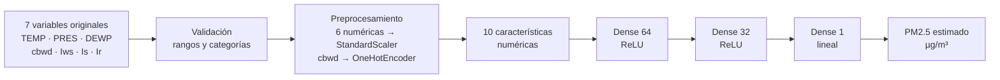
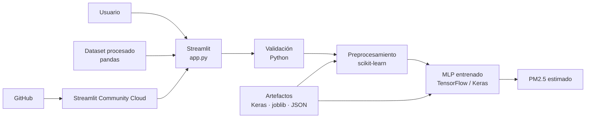

<div align="center">


# AerQualitas

### Estimación de PM2.5 con Deep Learning a partir de variables meteorológicas

Aplicación web interactiva desarrollada en **Python** con un **MLP feedforward** para estimar concentraciones de PM2.5 y apoyar la evaluación de la calidad del aire.

[](https://www.python.org/)
[](https://www.tensorflow.org/)
[](https://streamlit.io/)
[](https://scikit-learn.org/)
[](https://archive.ics.uci.edu/dataset/381/beijing%2Bpm2%2B5%2Bdata)
[](https://aerqualitas.streamlit.app/)

**Instituto Internacional de Aguascalientes**  
Maestría en Inteligencia Artificial para la Transformación Digital · Aprendizaje Profundo

[🚀 Abrir AerQualitas](https://aerqualitas.streamlit.app/) ·
[Repositorio](https://github.com/edtech-mx-ve/aerqualitas) ·
[Institución](https://www.iinternacional.edu.mx/) ·
[Dataset UCI](https://archive.ics.uci.edu/dataset/381/beijing%2Bpm2%2B5%2Bdata)

</div>

---

## Aplicación en línea

AerQualitas está desplegada públicamente en **Streamlit Community Cloud** y puede utilizarse directamente desde el navegador:

### 👉 [https://aerqualitas.streamlit.app/](https://aerqualitas.streamlit.app/)

No requiere instalación local para realizar estimaciones. La aplicación utiliza el **modelo MLP ya entrenado**, junto con su preprocesador y metadatos de inferencia versionados en el repositorio.

---

## ¿Qué hace AerQualitas?

AerQualitas estima la concentración de **PM2.5** a partir de siete variables meteorológicas históricas:

`TEMP` · `PRES` · `DEWP` · `cbwd` · `Iws` · `Is` · `Ir`

La aplicación:

- valida que los valores de entrada estén dentro del dominio conocido por el modelo;
- aplica el mismo preprocesamiento usado durante el entrenamiento;
- transforma 7 variables originales en 10 características numéricas;
- ejecuta una red neuronal **MLP feedforward**;
- devuelve una estimación puntual de PM2.5 en `µg/m³`;
- permite explorar dataset, preprocesamiento, modelo, evaluación, predicción y ayuda técnica.

> **Importante:** AerQualitas no mide físicamente la calidad del aire y no calcula un AQI oficial. Produce una estimación de PM2.5 basada en un modelo entrenado con datos históricos.

---

## Arquitectura didáctica del flujo del modelo

AerQualitas transforma una observación meteorológica en una estimación de PM2.5 mediante una secuencia explícita de validación, preprocesamiento e inferencia.



En forma compacta:

```text
7 variables meteorológicas
→ validación
→ preprocesamiento
→ 10 características
→ Dense(64, ReLU)
→ Dense(32, ReLU)
→ Dense(1, lineal)
→ PM2.5 estimado
```

### ¿De dónde salen los pesos del MLP?

```text
Variables meteorológicas históricas + PM2.5 observado
                    ↓
               entrenamiento
                    ↓
          MSE + backpropagation + Adam
                    ↓
           pesos y sesgos aprendidos
                    ↓
          model/aerqualitas_mlp.keras
                    ↓
              inferencia web
```

Los pesos no están definidos manualmente. Son parámetros aprendidos durante el entrenamiento con observaciones históricas del dataset Beijing PM2.5.
---

## Integración tecnológica implementada

Esta misma integración está documentada dentro de la aplicación en **Ayuda → Tecnologías**.


AerQualitas separa presentación, datos, validación, preprocesamiento, modelado, evaluación e inferencia para mantener una arquitectura clara y reproducible.

| Capa | Tecnología / artefacto | Responsabilidad |
|---|---|---|
| Interfaz | Streamlit / `app.py` | Navegación, formularios, tablas, gráficos y presentación de resultados |
| Datos | pandas / `src/aerqualitas/data` | Lectura, validación, limpieza y exploración del dataset procesado |
| Validación | Python / `src/aerqualitas/inference/validation.py` | Tipos, categorías y rangos permitidos |
| Preprocesamiento | scikit-learn | `StandardScaler`, `OneHotEncoder` y `ColumnTransformer` |
| Baseline | scikit-learn | Regresión lineal de referencia |
| Deep Learning | TensorFlow / Keras | MLP feedforward `64 → 32 → 1` |
| Persistencia | Keras + joblib + JSON | Modelo, preprocesador y metadatos |
| Evaluación | scikit-learn / NumPy | MAE, RMSE, R² y análisis de errores |
| Integridad | SHA-256 | Verificación del modelo y el preprocesador |
| Versionado | Git / GitHub | Código y artefactos esenciales |
| Despliegue | Streamlit Community Cloud | Ejecución pública de la aplicación |



**Flujo tecnológico resumido:**  
`Usuario → Streamlit → validación → scikit-learn → TensorFlow/Keras → PM2.5 estimado`

---

## Arquitectura del modelo

La arquitectura también se explica de forma didáctica dentro de la aplicación en **Ayuda → Modelo DL**.


El modelo final es un **MLP feedforward para regresión**:

```text
7 variables originales
        ↓
StandardScaler + OneHotEncoder
        ↓
10 características
        ↓
Dense(64, ReLU)
        ↓
Dense(32, ReLU)
        ↓
Dense(1, lineal)
```

### Configuración principal

| Elemento | Configuración |
|---|---|
| Framework | TensorFlow / Keras |
| Tipo de modelo | MLP feedforward |
| Problema | Regresión supervisada |
| Capa oculta 1 | 64 neuronas, ReLU |
| Capa oculta 2 | 32 neuronas, ReLU |
| Salida | 1 neurona, lineal |
| Función de pérdida | MSE |
| Optimizador | Adam |
| Learning rate inicial | 0.001 |
| Batch size | 64 |
| Máximo de épocas | 200 |
| Early stopping | Sí |
| Semilla | 42 |

---

## Dataset

Se utiliza **Beijing PM2.5**, disponible en el UCI Machine Learning Repository.

**Referencia oficial:**

> Chen, S. (2015). *Beijing PM2.5* [Dataset]. UCI Machine Learning Repository. https://doi.org/10.24432/C5JS49

### Resumen

| Elemento | Valor |
|---|---:|
| Registros originales | 43,824 |
| Registros sin PM2.5 | 2,067 |
| Registros utilizados | 41,757 |
| Periodo | 2010–2014 |
| Frecuencia | Horaria |
| Variable objetivo | `pm2.5` |
| Licencia del dataset | CC BY 4.0 |

Los registros sin PM2.5 se excluyen del aprendizaje supervisado porque no contienen la respuesta objetivo.

```text
43,824 originales
      ↓
- 2,067 sin PM2.5
      ↓
41,757 utilizables
```

---

## Variables utilizadas

| Variable | Rol | Descripción |
|---|---|---|
| `TEMP` | Predictor | Temperatura del aire |
| `PRES` | Predictor | Presión atmosférica |
| `DEWP` | Predictor | Punto de rocío |
| `cbwd` | Predictor | Dirección combinada del viento |
| `Iws` | Predictor | Velocidad acumulada del viento |
| `Is` | Predictor | Horas acumuladas de nieve |
| `Ir` | Predictor | Horas acumuladas de lluvia |
| `pm2.5` | Objetivo | Concentración observada de PM2.5 |

---

## Preprocesamiento

La partición se realiza **cronológicamente y sin barajar**, para evitar fuga de información:

| Partición | Porcentaje | Registros |
|---|---:|---:|
| Entrenamiento | 70 % | 29,229 |
| Validación | 15 % | 6,264 |
| Prueba | 15 % | 6,264 |

Transformaciones:

- variables numéricas → `StandardScaler()`
- dirección del viento → **One-Hot Encoding** con `OneHotEncoder()`

Como resultado:

```text
7 variables originales → 10 características numéricas
```

---

## Línea base

Antes de entrenar el MLP se construyó una **regresión lineal** como modelo de referencia.

La finalidad de la línea base es comprobar si la red neuronal aporta una mejora real y medible.

---

## Resultados finales

### Conjunto de prueba reservado

| Métrica | Regresión lineal | MLP | Mejor modelo |
|---|---:|---:|---|
| MAE | 52.284 | **47.782** | MLP |
| RMSE | 70.052 | **64.584** | MLP |
| R² | 0.216 | **0.333** | MLP |

**Resultado:** el MLP supera la línea base en **3 de 3 métricas**.

### Interpretación

- **MAE**: error absoluto medio. Menor es mejor.
- **RMSE**: penaliza más los errores grandes. Menor es mejor.
- **R²**: proporción de variabilidad explicada. Mayor es mejor.

> El modelo mejora la línea base, aunque un R² de 0.333 indica que todavía existe variabilidad del PM2.5 que no está explicada por las variables disponibles.

---

## Fundamento del cálculo

Después del preprocesamiento, el modelo recibe un vector numérico `x'` de 10 características.

La red neuronal puede resumirse así:

```text
PM2.5 estimado =
W3 · ReLU(
    W2 · ReLU(
        W1 · x' + b1
    ) + b2
) + b3
```

### Lectura por capas

```text
x'
↓
Dense(64, ReLU)   → h1 = ReLU(W1 · x' + b1)
↓
Dense(32, ReLU)   → h2 = ReLU(W2 · h1 + b2)
↓
Dense(1, lineal)  → PM2.5 estimado = W3 · h2 + b3
```

donde:

- `x'` representa las 10 características después del preprocesamiento;
- `W1`, `W2`, `W3` son matrices de pesos aprendidos;
- `b1`, `b2`, `b3` son sesgos aprendidos;
- `ReLU` introduce no linealidad en las capas ocultas;
- la capa final es lineal porque PM2.5 es una variable continua.

Los pesos y sesgos fueron **aprendidos durante el entrenamiento** y se conservan en `model/aerqualitas_mlp.keras`.

> **Importante:** AerQualitas no utiliza una ecuación meteorológica fija definida manualmente ni calcula físicamente masa de partículas sobre volumen de aire. El modelo aprende empíricamente la relación entre variables meteorológicas y concentraciones históricas observadas de PM2.5.
---

## Funciones esenciales del proyecto

```text
chronological_split()
build_preprocessor()
build_linear_baseline()
build_mlp()
fit_mlp()
run_final_evaluation()
validate_user_input()
load_final_inference_assets()
predict_pm25()
```

Flujo de inferencia:

```text
validate_user_input()
        ↓
preprocessor.transform()
        ↓
model.predict()
        ↓
predict_pm25()
```

---

## Funcionalidades de la app

La interfaz contiene:

- **Inicio** — resumen ejecutivo y estimación rápida;
- **Dataset** — origen, calidad, credenciales, explorador paginado y diccionario;
- **Preprocesamiento** — división temporal, transformaciones y baseline;
- **Modelo DL** — arquitectura, entrenamiento y validación;
- **Evaluación** — métricas finales y análisis de errores;
- **Predicción** — entrada manual y ejemplos preestablecidos;
- **Ayuda** — funcionamiento, dataset, Modelo DL, tecnologías y glosario;
- **Institucional** — identificación académica y técnica.


### Organización de la sección Ayuda

La sección **Ayuda** se divide en cinco pestañas:

| Pestaña | Contenido |
|---|---|
| Cómo funciona | Resumen del flujo general de AerQualitas |
| Dataset | Origen, variables, alcance y limitaciones de los datos |
| Modelo DL | Explicación del MLP feedforward utilizado y su arquitectura |
| Tecnologías | Integración tecnológica implementada en la aplicación |
| Glosario | Definiciones breves de los términos técnicos principales |

La pestaña **Tecnologías** documenta la separación entre interfaz, datos, validación, preprocesamiento, modelado, evaluación, persistencia, integridad, versionado y despliegue. Su flujo resumido es:

```text
Usuario
→ Streamlit
→ validación
→ scikit-learn
→ TensorFlow/Keras
→ PM2.5 estimado
```

Esta organización mantiene la documentación técnica accesible desde la propia aplicación sin mezclarla con la lógica de inferencia.

---

# Inicio rápido

## Opción A — Ejecutar la app localmente

### 1. Clonar el repositorio

```powershell
git clone https://github.com/edtech-mx-ve/aerqualitas.git
cd aerqualitas
```

### 2. Crear entorno virtual con Python 3.11

```powershell
py -3.11 -m venv .venv
```

### 3. Activar el entorno

```powershell
Set-ExecutionPolicy -Scope Process -ExecutionPolicy Bypass
.\.venv\Scripts\Activate.ps1
```

Comprueba:

```powershell
python --version
```

Debe mostrar:

```text
Python 3.11.x
```

### 4. Instalar dependencias

```powershell
python -m pip install --upgrade pip
pip install -r requirements.txt
```

### 5. Verificar TensorFlow

```powershell
python -c "import tensorflow as tf; print(tf.__version__)"
```

Versión esperada:

```text
2.17.1
```

### 6. Ejecutar

```powershell
streamlit run app.py
```

Abrir:

```text
http://localhost:8501
```

---

# Verificación local

Antes de publicar cambios se recomienda comprobar que el código compile y que la app arranque correctamente:

```powershell
python -m compileall src app.py
streamlit run app.py
```

Durante el desarrollo académico se utilizó además una suite automatizada con `pytest`. Esa suite pertenece al entorno local de desarrollo y no al paquete público mínimo de despliegue.
---

# Modelo entrenado e inferencia

El repositorio público está optimizado para **despliegue e inferencia**. La aplicación utiliza el MLP ya entrenado y el preprocesador persistido:

```text
model/aerqualitas_mlp.keras
model/preprocessor.joblib
model/inference_metadata.json
model/final_model_manifest.json
model/mlp_metadata.json
```

Para utilizar la aplicación **no es necesario volver a entrenar el modelo**.

El entrenamiento, la evaluación y las pruebas completas se realizaron durante el desarrollo académico. El repositorio de despliegue conserva los componentes necesarios para ejecutar la app, reproducir la inferencia y documentar sus resultados.
---

# Estructura del repositorio público

El repositorio publicado contiene los archivos esenciales de ejecución y despliegue:

```text
aerqualitas/
│
├── app.py
├── README.md
├── requirements.txt
├── .gitignore
│
├── .streamlit/
│   └── config.toml
│
├── assets/
│   └── logo.png
│
├── src/
│   └── aerqualitas/
│       ├── __init__.py
│       ├── config.py
│       ├── paths.py
│       ├── logging_config.py
│       ├── validation.py
│       ├── data/
│       ├── modeling/
│       └── inference/
│
├── model/
│   ├── aerqualitas_mlp.keras
│   ├── preprocessor.joblib
│   ├── inference_metadata.json
│   ├── final_model_manifest.json
│   └── mlp_metadata.json
│
└── data/
    └── processed/
        ├── beijing_pm25_clean.csv
        ├── data_quality_report.json
        ├── split_manifest.json
        ├── baseline_metrics.json
        ├── baseline_validation_predictions.csv
        ├── mlp_metrics.json
        ├── mlp_training_history.csv
        ├── mlp_validation_predictions.csv
        ├── final_test_metrics.json
        ├── final_test_predictions.csv
        ├── final_error_analysis.json
        └── final_error_by_quartile.csv
```

No se publican entornos virtuales, logs, backups, secretos, archivos temporales ni el dataset crudo.
---

# GitHub — primera publicación

Repositorio:

<https://github.com/edtech-mx-ve/aerqualitas>

Desde la carpeta local del proyecto:

```powershell
git init
git branch -M main
git remote add origin https://github.com/edtech-mx-ve/aerqualitas.git
git status
git add app.py README.md requirements.txt .gitignore
git add .streamlit/config.toml assets/logo.png
git add src/aerqualitas model data/processed
git commit -m "Initial release AerQualitas v0.8.0"
git push -u origin main
```

Si `origin` ya existe:

```powershell
git remote -v
```

No vuelvas a agregarlo.

---

# Actualizar GitHub

Después de hacer cambios y probar:

```powershell
python -m compileall src app.py
git status
git add <archivos_modificados>
git commit -m "Describe el cambio realizado"
git push
```

---

# Despliegue en Streamlit Community Cloud

**Estado:** ✅ Desplegada públicamente

**URL de producción:** [https://aerqualitas.streamlit.app/](https://aerqualitas.streamlit.app/)

El despliegue utiliza el repositorio `edtech-mx-ve/aerqualitas`, la rama `main`, `app.py` como archivo principal y Python 3.11.


## Requisitos previos

Antes de desplegar:

```powershell
pytest -q
streamlit run app.py
```

Comprueba que todas las secciones funcionen.

## Pasos

1. Ir a: <https://share.streamlit.io/>
2. Iniciar sesión con GitHub.
3. Seleccionar **Create app**.
4. Repositorio:

```text
edtech-mx-ve/aerqualitas
```

5. Rama:

```text
main
```

6. Archivo principal:

```text
app.py
```

7. En **Advanced settings**, seleccionar **Python 3.11**.
8. No agregar secretos: AerQualitas no requiere claves privadas.
9. Pulsar **Deploy**.

---

# Contenido esencial del repositorio

El despliegue público conserva:

```text
app.py
README.md
requirements.txt
.gitignore
.streamlit/config.toml
assets/
src/aerqualitas/
model/
data/processed/
```

No se publican:

```text
.venv/
__pycache__/
.pytest_cache/
logs/
data/raw/
docs/
tests/
Backups/
*.zip
*.pyc
.env
.streamlit/secrets.toml
```

Esta separación mantiene el repositorio enfocado en la ejecución pública de AerQualitas y evita incluir archivos internos de desarrollo innecesarios.
---

# Solución de problemas

### PowerShell bloquea el entorno virtual

```powershell
Set-ExecutionPolicy -Scope Process -ExecutionPolicy Bypass
.\.venv\Scripts\Activate.ps1
```

### `streamlit` no se reconoce

```powershell
.\.venv\Scripts\Activate.ps1
pip install -r requirements.txt
```

### TensorFlow no carga

```powershell
python -c "import tensorflow as tf; print(tf.__version__)"
```

Si falla:

```powershell
pip install --force-reinstall tensorflow==2.17.1
```

### Falta el modelo

```powershell
Get-ChildItem .\model
```

Deben existir al menos:

```text
aerqualitas_mlp.keras
preprocessor.joblib
final_model_manifest.json
inference_metadata.json
```

### Falta el dataset limpio

```powershell
python prepare_data.py --overwrite
```

### Puerto 8501 ocupado

```powershell
streamlit run app.py --server.port 8502
```

---

# Seguridad y robustez

AerQualitas incorpora:

- validación de tipos y rangos;
- restricciones del dominio de inferencia;
- separación temporal;
- prevención de fuga de datos;
- persistencia del modelo y preprocesador;
- verificación SHA-256 de artefactos;
- logging;
- pruebas automatizadas;
- `.gitignore` para excluir archivos temporales y sensibles.

---

# Limitaciones

- El modelo fue entrenado con datos históricos de Beijing.
- No incorpora directamente tráfico, emisiones industriales u otras fuentes externas.
- No mide PM2.5 físicamente.
- No produce AQI oficial.
- Su uso en otras ciudades requiere nuevos datos, entrenamiento y evaluación.
- Las predicciones fuera del dominio de entrenamiento se bloquean.
- Un R² de 0.333 indica que todavía existe variabilidad no explicada.

---

# Autoría

**Antonio Nicolás Toro González**  
Maestría en Inteligencia Artificial para la Transformación Digital  
Instituto Internacional de Aguascalientes

**Tutora:** Dra. Claudia Andrea Vidales Basurto

---

# Enlaces

- **Repositorio:** https://github.com/edtech-mx-ve/aerqualitas
- **Institución:** https://www.iinternacional.edu.mx/
- **Dataset:** https://archive.ics.uci.edu/dataset/381/beijing%2Bpm2%2B5%2Bdata
- **DOI:** https://doi.org/10.24432/C5JS49
- **Aplicación en línea:** https://aerqualitas.streamlit.app/
- **Streamlit Community Cloud:** https://share.streamlit.io/

---

<div align="center">

### AerQualitas

**Variables meteorológicas → Preprocesamiento → MLP entrenado → PM2.5 estimado**

Versión 0.8.0 · Aplicación desplegada en Streamlit Community Cloud

Ayuda actualizada con pestañas **Modelo DL** y **Tecnologías** para documentar la arquitectura y la integración técnica de la aplicación.

Proyecto académico de Deep Learning aplicado.

</div>
